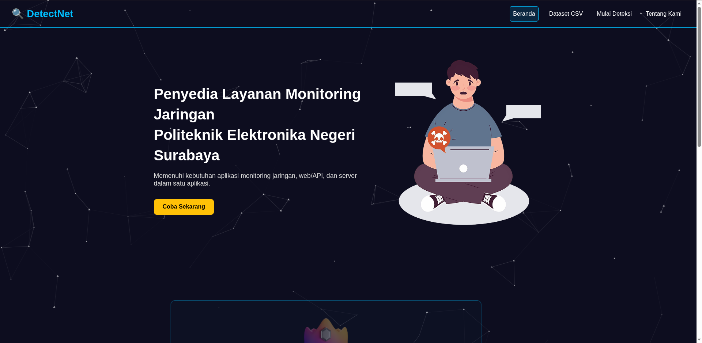
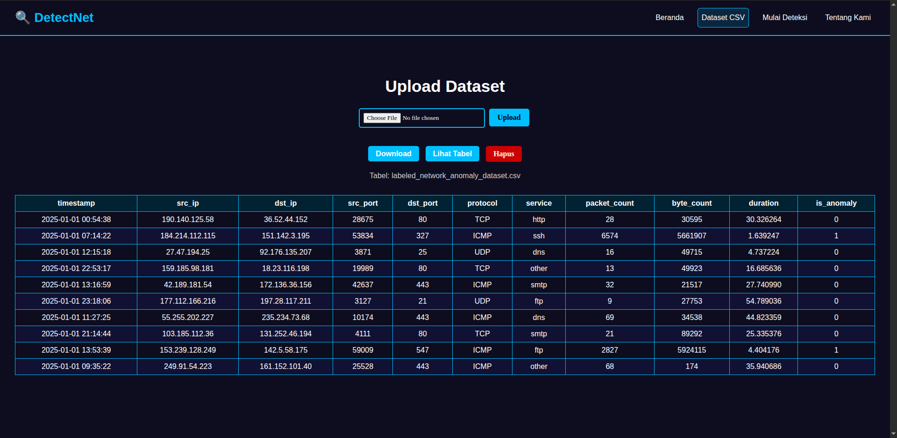
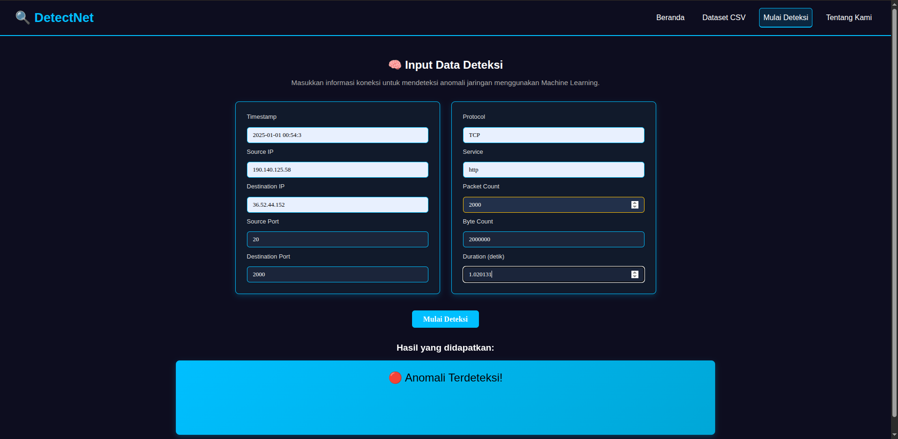

# 🚨 DetectNet - Intelligent Network Anomaly Detection System 

🔗 **Live Demo:** [https://103.151.140.139.sslip.io/](https://103.151.140.139.sslip.io/)

---

## 🧠 Project Overview

**DetectNet** is a web-based Decision Support System (DSS) designed to intelligently detect anomalies in network traffic. Built for *Politeknik Elektronika Negeri Surabaya (PENS)*, this tool empowers network administrators to identify suspicious patterns in real time, enabling faster response to potential threats.

This project addresses the growing demand for intelligent network monitoring tools that are easy to use, accessible, and reliable — especially in academic or institutional IT environments where custom tools are highly valued.

---

## ✨ Key Features

- ⚡ **Instant anomaly detection** via manual input of network connection data.
- 📁 **Bulk anomaly analysis** through `.csv` file upload.
- 📊 **Interactive dashboard** to manage, explore, and visualize uploaded datasets.
- 🌐 **User interface fully in Bahasa Indonesia**, making it accessible for local users and institutions.

---

## 🖼️ User Interface Preview

1. **Main Dashboard**
   - 
2. **Manual Input Page**
   - 
3. **Dataset Management**
   - 

---

## 🏗️ Architecture & Tech Stack

| Layer      | Tools & Frameworks                     |
|------------|----------------------------------------|
| **Backend**   | Python, Flask                         |
| **Frontend**  | HTML, CSS, JavaScript                 |
| **ML/AI**     | Scikit-learn, Pandas, NumPy           |
| **Deployment**| Web server hosted via public IP (SSLIP) |

---

## 🧪 Machine Learning Model

### 🔍 Model: Random Forest Classifier

DetectNet uses the **Random Forest** algorithm — a robust, ensemble-based classifier known for its high accuracy, resistance to overfitting, and versatility in handling various feature types.

- **Why Random Forest?**
  - Performs well on tabular data with both categorical and numerical features.
  - Naturally handles non-linear relationships.
  - Provides feature importance for interpretability.

- **Model Pipeline (Developed by: Achmed Nazriel Lesmono)**
  - 📦 Dataset collection & preprocessing
  - ⚙️ Feature selection & scaling
  - 🏋️ Training with Random Forest (Scikit-learn)
  - 📈 Validation using metrics like accuracy, precision, recall, and F1-score

- **Model Performance:**
  - 

---

## ⚙️ Installation & Usage Guide

Follow these steps to run DetectNet locally:
```bash
# 1. Clone the repository
git clone https://github.com/nazriellesmono/DetectNet.git
cd DetectNet

# 2. Create a virtual environment
python3 -m venv venv
source venv/bin/activate  # On Windows: venv\Scripts\activate

# 3. Install dependencies
pip install -r requirements.txt

# 4. Run the Flask application
python app.py

# Access the app at:
# http://localhost:5000
```
---
## 👨‍💻 Development Team

| Name                      | Student ID   | Role                                      |
|---------------------------|--------------|-------------------------------------------|
| **Achmed Nazriel Lesmono**| 2423600003   | **Machine Learning Engineer & Presenter** |
| Dinjino Evano Febriant    | 2423600005   | Backend Developer                         |
| Moh. Ar Ridho Al Ihsan    | 2423600009   | UI/UX & Frontend Design                   |
| Muhammad Nizamudin M      | 2423600024   | Frontend Developer                        |

---

## 🔮 Future Work

DetectNet sets the foundation for intelligent network monitoring. Future enhancements may include:

- 🧠 **Explainable AI (XAI):** Visualizing why certain anomalies are detected to aid decision-making.
- 📈 **Online Learning:** Enabling the model to adapt and improve continuously with new network data.
- 🧰 **User Authentication:** Adding admin/user login and role-based access.
- 🌍 **Multilingual Support:** Supporting English and Bahasa Indonesia for wider reach.
- 📡 **Real-Time Packet Sniffing:** Integrating with live network data streams using tools like Scapy or Wireshark.

---

## 📜 License

This project is for educational and research purposes only. Licensing details can be discussed upon request.


